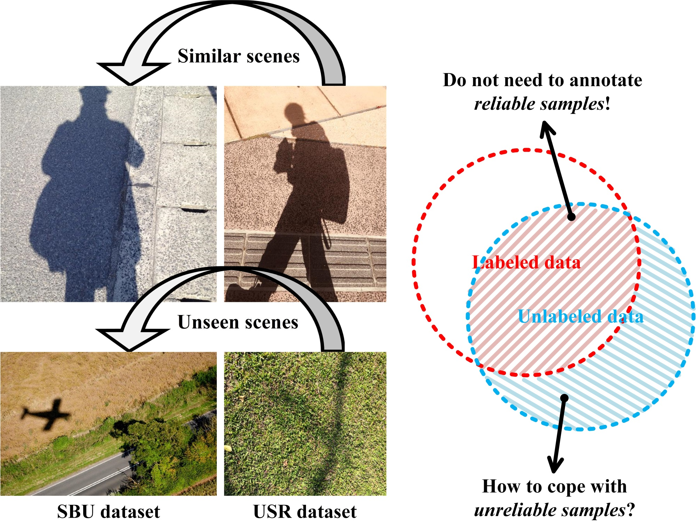

# How Many Annotations Do We Need for Generalizing New-coming Shadow Images?

by Wen Wu, Weiyin Ma and Xiao-Diao Chen

This implementation is written by Wen Wu at the Hangzhou Dianzi University.
***

## Mix-USR dataset
| Dataset | URL |
|----------|----------|
| S-USR | [BaiduNetdisk](https://pan.baidu.com/s/1y42iytWurfEDFOXEuMXX0w)(osg1) |
| B-USR | [BaiduNetdisk](https://pan.baidu.com/s/184VQCPMmDrrNKSvlRn6c3w)(qx57) |
| P-USR | [BaiduNetdisk](https://pan.baidu.com/s/1f6Sa8oJhxecIYyhR2oFqKw)(8wv6) |
| Tesing set| [BaiduNetdisk](https://pan.baidu.com/s/1lK9J_N6XIboLwrLh-_eg6Q)(vdfg) |

## Citation
@article{wu2023sdtr,                  
&nbsp;&nbsp;&nbsp;&nbsp;  author = {Wu, Wen and Ma, Weiyin and Chen, Xiao-Diao},      
&nbsp;&nbsp;&nbsp;&nbsp;  title = {How many annotations do we need for generalizing new-coming shadow images?},      
&nbsp;&nbsp;&nbsp;&nbsp;  journal = {IEEE Transactions on Circuits and Systems for Video Technology},       
&nbsp;&nbsp;&nbsp;&nbsp;  year = {2023},      
&nbsp;&nbsp;&nbsp;&nbsp;  volume={None},      
&nbsp;&nbsp;&nbsp;&nbsp;  number={None},      
&nbsp;&nbsp;&nbsp;&nbsp;  pages={1-12},      
&nbsp;&nbsp;&nbsp;&nbsp;  doi={10.1109/TCSVT.2023.3263903}      
}
